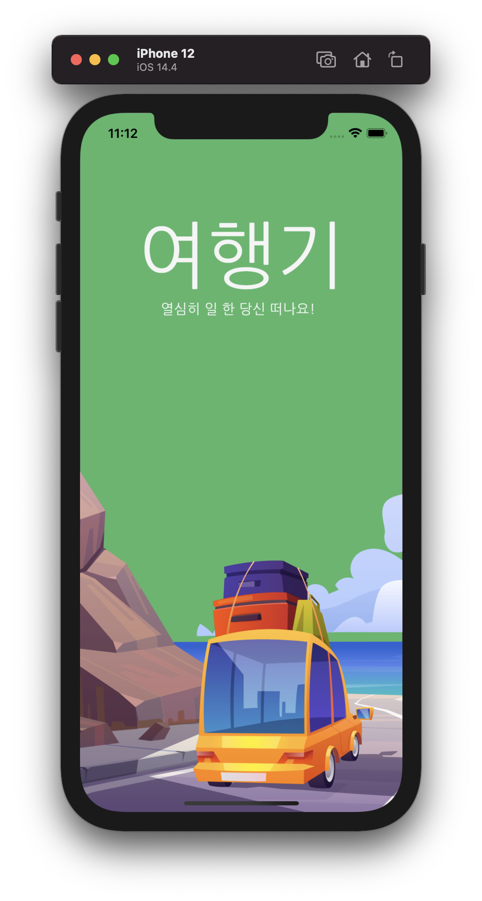
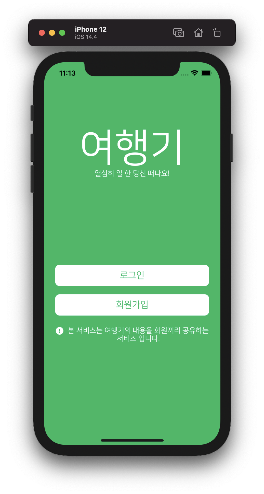
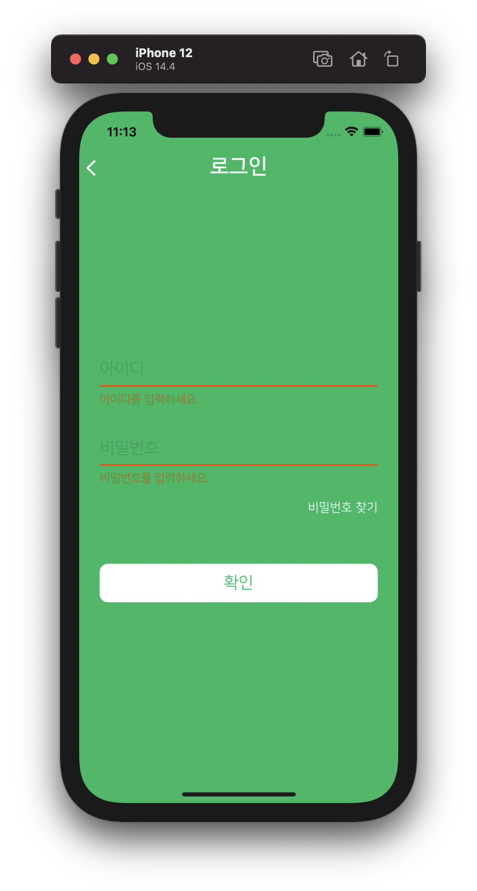
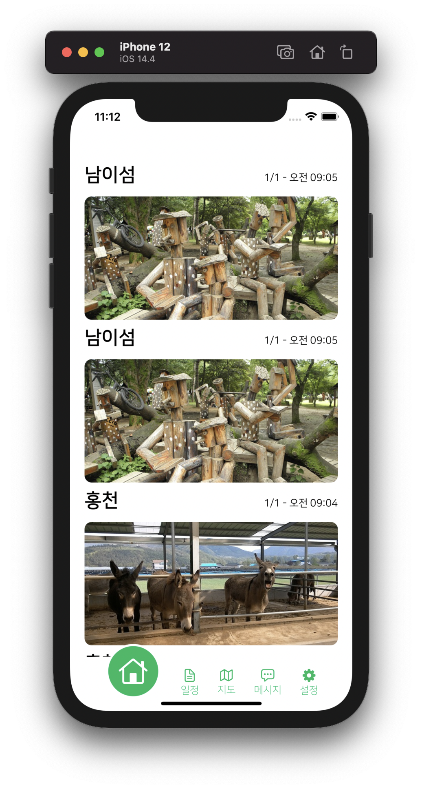
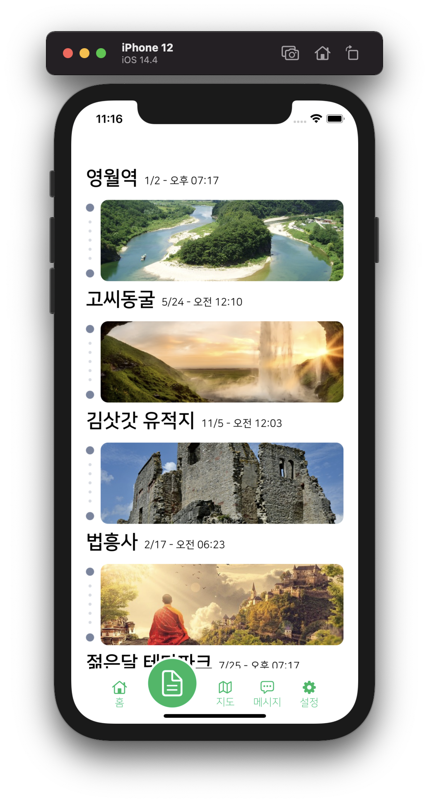
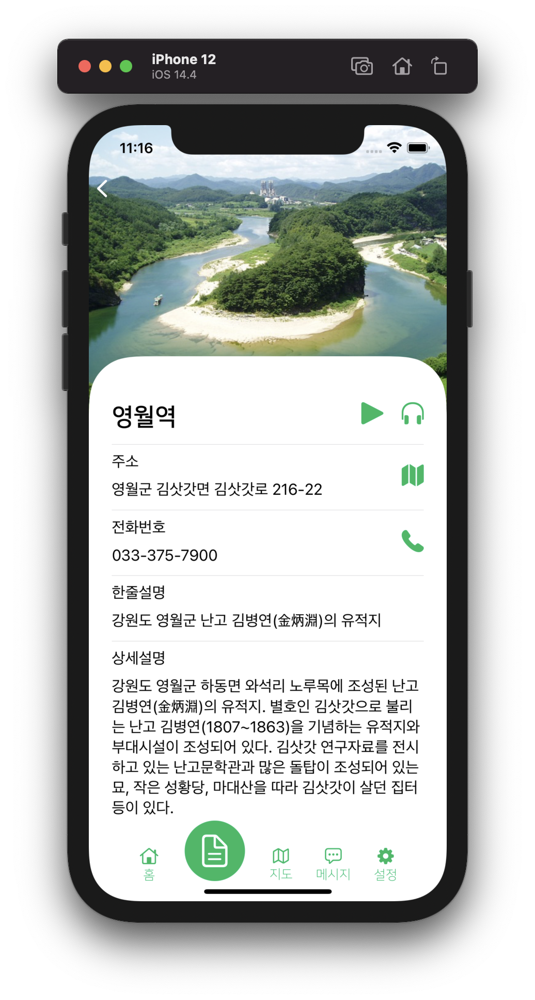
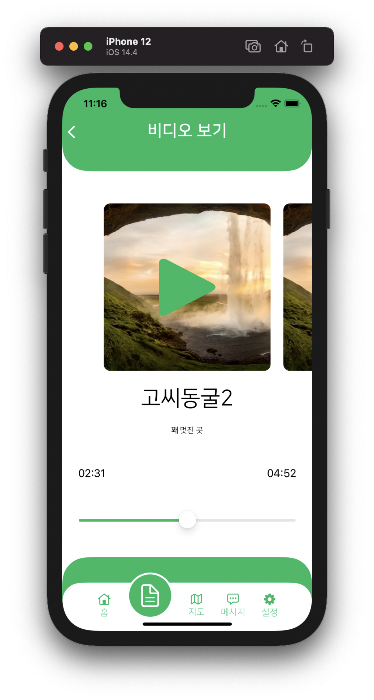

# trip-story
trip-story demo app implemented with SwiftUI + Combine

2021-01 ~ 

SwiftUI 의 UI Customizing의 한계가 아직은 있음을 느꼈습니다. 저 스스로 모르는 부분이 아직 많은 것 같습니다. 조금 더 공부하고 오겠습니다.

## Demo Video

## Features
- Clean Architecture (View, ViewModel, Interactor, Model, Repository)
- Dependency Injection
- Localization
- Auth with Firebase or node server
- Combime + SwiftUI

## Screenshots

